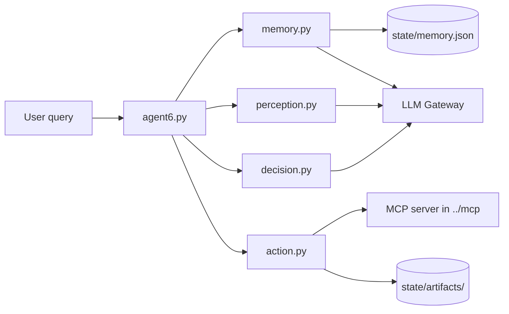

# Assignment 6 — Modular LLM Agent

A loop-based agent that breaks a user query into goals, reads long-term memory, calls MCP tools when needed, and produces a final summary. Each cognitive step lives in its own module and talks to a shared **LLM gateway** (`http://localhost:8101` by default).

##Youtube link for demo
https://youtu.be/qP2cNoKGQVo

## Architecture



Each iteration of the main loop:

1. **Memory read** — keyword-match relevant items from `state/memory.json`
2. **Perception** — update goals (done/open, artifact attachments)
3. **Decision** — answer from memory/history or choose an MCP tool
4. **Action** — run the tool; store large results as artifacts
5. **Memory write** — persist large tool outcomes; keep small results only in run history

When all goals are satisfied, the agent builds a **final summary** and writes per-goal entries back into memory for future runs.

## Project files

| File | Role |
|------|------|
| **`agent6.py`** | Entry point and orchestrator. Connects to the MCP server, runs the perception → decision → action loop (up to 10 iterations), prints step logs, generates the final summary, and saves completed goals to memory. |
| **`perception.py`** | **Perception** module. Calls the gateway with `auto_route: perception` to decompose the query into goals and mark goals complete when memory or run history already satisfies them. |
| **`decision.py`** | **Decision** module. Calls the gateway with `auto_route: decision` and optional MCP tool definitions. Returns either a direct answer or a `ToolCall` for the current goal. |
| **`action.py`** | **Action** module. Executes MCP tools via `ClientSession.call_tool`. Results over 4 KB are stored in the artifact store and returned as a short descriptor plus `art:…` handle. |
| **`memory.py`** | **Memory** module. Keyword-based `read()`, LLM-assisted `remember()` / `record_outcome()`, and an on-disk **artifact store** for large blobs. |
| **`schemas.py`** | Shared **Pydantic models**: `MemoryItem`, `Artifact`, `Goal`, `Observation`, `ToolCall`, `DecisionOutput`. |
| **`config.py`** | Gateway URLs. Override the base URL with the `GATEWAY_URL` environment variable (default `http://localhost:8101`). |
| **`.gitignore`** | Ignores runtime `state/`, Python caches, virtualenvs, and secrets. |

## Runtime data (`state/`)

Created at run time (not checked into git):

- **`state/memory.json`** — Long-term memory items (facts, preferences, tool outcomes) with keywords for retrieval.
- **`state/artifacts/`** — Binary payloads for large tool results (`art:<hash>.bin` + metadata JSON).

## Run history (in-memory)

During a single run, `agent6.py` keeps a `history` list passed into perception and decision:

| `kind` | Meaning |
|--------|---------|
| `answer` | Decision produced a final answer for a goal. |
| `tool_small` | Tool result under 4 KB; kept in history only (not written to memory). |
| `action` | Large tool result; descriptor + optional `artifact_id`; also recorded via `memory.record_outcome()`. |

The final summarizer uses `answer`, `tool_small`, and `action` entries so a run can finish after a successful tool call even if decision never emitted a separate answer.

## Prerequisites

1. **LLM gateway** running and reachable at `GATEWAY_URL` (see `config.py`).
2. **MCP server** in the parent `mcp/` folder (`mcp_server_6.py`, or `mcp_server.py` as fallback). Started automatically by `agent6.py` over stdio.
3. Python packages: `httpx`, `pydantic`, `mcp` (and dependencies for the MCP server).

## Usage

From the `Assgn6` directory:

```bash
python agent6.py Tell me about Claude Shannon from Wikipedia
```

The agent prints loop steps (`[Step 1: Memory]` … `[Step 4: Action]`) and ends with a **FINAL SUMMARY** block.

## External dependencies

- **`../mcp/mcp_server_6.py`** — MCP tool server (e.g. web search) used by `action.py`.
- **LLM gateway** — HTTP API at `/v1/chat` and `/v1/status`; routes requests by `auto_route` (`perception`, `decision`, `memory`).

Adjust the Python interpreter path in `agent6.py` (`mcp_session` → `StdioServerParameters`) if your environment uses a different Python installation.
